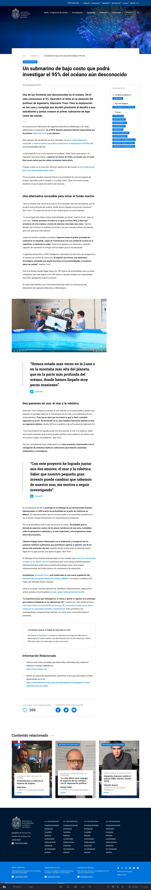
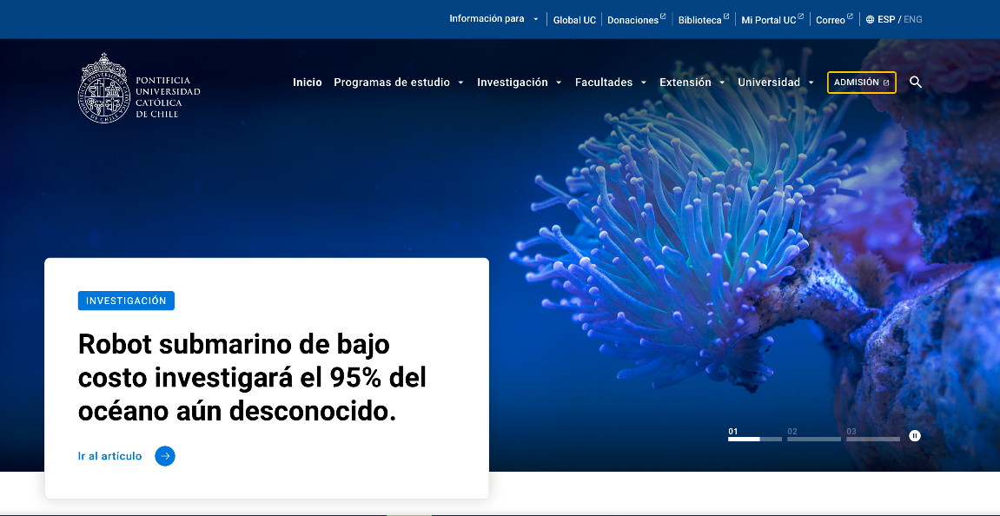
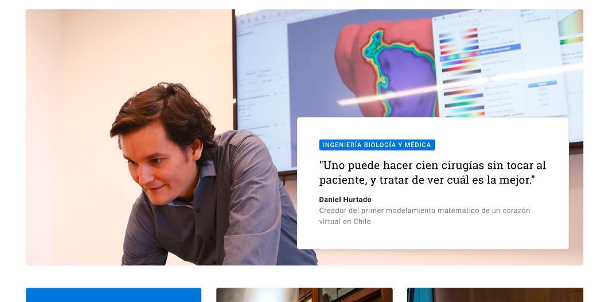

# Destacado Portada

### **DESTACADO PORTADA**

### **Definiciones técnicas:**

* Foto:
  * Dimensiones: 1440 x 623 px
  * Proporción: 16:9
  * Punto focal: a la izquierda.
  * Orientación: apaisada.
  * Peso mínimo:
  * Formato: jpg o png.
* Títulos: entre 50 y 96 caracteres
* Bajada:
  * mínimo 150 caracteres
  * máximo 316 caracteres
* Quotes:
  * mínimo 200 caracteres
  * máximo 400 caracteres
* Extensión de textos:
  * mínimo: 1.000 palabras
  * máximo: 3.000 palabras \(como un artículo RU\)

### **Definiciones de metadatos:**

* **Etiquetas obligatorias:**
  * tema \(visible\)
  * perfil de usuario \(no visible\)
* **Etiquetas optativas:**
  * eje estratégico \(visible\)
  * unidad académica \(visible\)

### Esquema

### Consideraciones para el contenido

**Foto:**

* La foto de cabecera tiene que tener orientación apaisada y punto focal a la derecha para que se vea bien en el despliegue del home.

**Para mejorar la accesibilidad y el posicionamiento, el texto puede incluir:**

* Subtítulos para facilitar escaneo.
* Ideas fuerza en negrita.
* Viñetas para listados.
* Citas o frases destacadas para twittear.
* Enlaces
* Elementos multimedia \(fotos y videos\).
* Recuadro con llamada a la acción.

### Se despliega así

### Lugares donde se utiliza:

#### HOME

