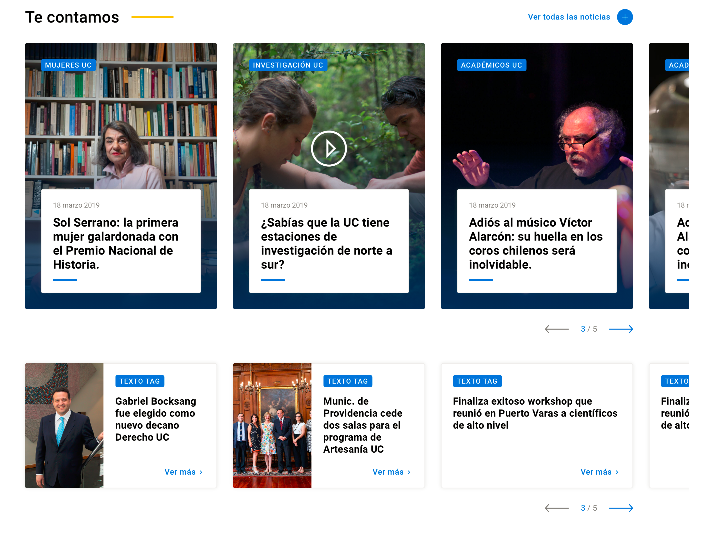

# Noticias

## Noticias

### **Definiciones técnicas:**

* **Foto:**
  * Dimensiones: 380 x 532
  * Proporción: 5:7
  * Punto focal: arriba y al centro
  * Orientación: vertical o apaisada
  * Peso mínimo:
  * Formato: jpg o png.
* **Títulos:** 
  * entre 50 y 96 caracteres
* **Bajada:**
  * mínimo 150 caracteres
  * máximo 316 caracteres
* **Quotes:**
  * mínimo 200 caracteres
  * máximo 400 caracteres
* **Extensión de textos:**
  * Mínimo: 500 palabras
  * Máximo: 1.500 palabras

### **Definiciones de metadatos:**

* **Etiquetas obligatorias:**
  * tema \(visible\)
  * perfil de usuario \(no visible\)
* **Etiquetas optativas:**
  * eje estratégico \(visible\)
  * unidad académica \(visible\)

### Esquema

Cambia el lugar de la foto:

|  |  |
| :--- | :---: |

### Consideraciones para el contenido

**Foto:**

* Puede tener orientación:
  * vertical, con punto focal arriba.
  * apaisada, con punto focal al centro.

**Para mejorar la accesibilidad y el posicionamiento, el texto puede incluir:**

* Subtítulos para facilitar escaneo.
* Ideas fuerza en negrita.
* Viñetas para listados.
* Citas o frases destacadas para twittear.
* Enlaces
* Elementos multimedia \(fotos y videos\).
* Recuadro con llamada a la acción.

### Lugares donde se utiliza:

#### HOME

