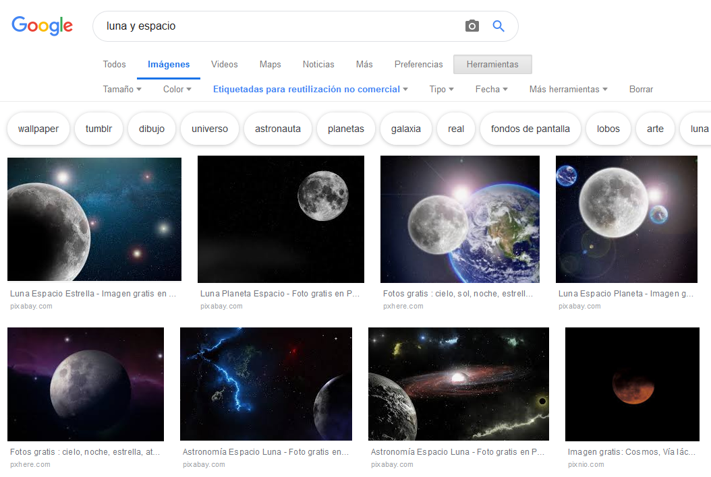

# Fotos

### ¿Cómo elegir las fotos?

* Elige fotos con **buena luz y contraste**. 
* Trata que muestren **a alguien haciendo algo**. \(Accesibilidad\)

### ¿Cómo guardar las fotos?

* Normaliza el nombre de los archivos fotos: \(Accesibilidad\)
  * Cambia todos los nombres raros por nombres comprensibles.
  * Separa las palabras con guión \(-\) o con guión bajo bajo \( \_ \)
  * Usa solo minúsculas.
  * No pongas tildes en el nombre del archivo.
  * Ejemplo:
    * Si la foto de una persona dice IMG323.jpg, cambiar a nombre-de-la-persona.jpg

### ¿Qué metadatos deben tener las fotos?

* Agrega el atributo alt o texto alternativo a todas las fotos: \(Accesibilidad y posicionamiento\)
  * Esto corresponde a un **texto que describe lo que pasa en la foto**. Si la foto no se carga, aparecerá este texto describiendo lo que ocurre en la foto. Es clave para que los sistemas de lectura para personas con necesidades especiales entiendan de qué se trata la foto.
  * Lo ideal es que el alt de la foto incluya la palabra o frase clave definida para el artículo.
  * Si hay más de una foto, las siguientes deben incluir un texto alternativo que tenga relación con el texto que está a su alrededor.
  * Ejemplo:
    * Si estamos en la página de perfil de una persona \(Rector Ignacio Sánchez\), la foto debe corresponder a esa persona.
    * El atributo alt o texto alternativo debe decir el nombre \(Ignacio Sánchez\), el cargo \(Rector UC\), y describir lo que hace \(aparece en una foto de medio cuerpo sonriendo a la cámara\).
* Copyright o derecho de autor: \(buenas prácticas web\)
  * Siempre se debe incluir el nombre del dueño de la foto, o el banco de imágenes del que se sacó.


El atributo alt es clave para cumplir criterios de accesibilidad: es la manera en que los sistemas de lectura para personas con discapacidad visual pueden describir lo que ocurre en una foto.


### Tipos de fotos que podemos usar

* Fotos sacadas especialmente para un tema. 
  * En este caso debemos contar con las autorizaciones correspondientes según lo establecido en el Anexo de [Autorización de uso de imagen](anexos/autorizacion-de-uso-de-imagen.md).
* Fotos del banco de imágenes UC:
  * Estas fotos ya cuentan con autorización, pero debemos asegurarnos de incluir el dato del autor de la foto.
* Fotos de bancos de imágenes gratuitos como:
  * [Pixabay](https://pixabay.com/)
  * [Pixlr](https://pixlr.com/)
* Fotos de Google:
  * En la sección imágenes de Google es posible encontrar imágenes que pueden ser reutilizadas. Es importante afinar la búsqueda indicando que nos muestre sólo las "Etiquetadas para reutilización no comercial", según se muestra en la foto.

